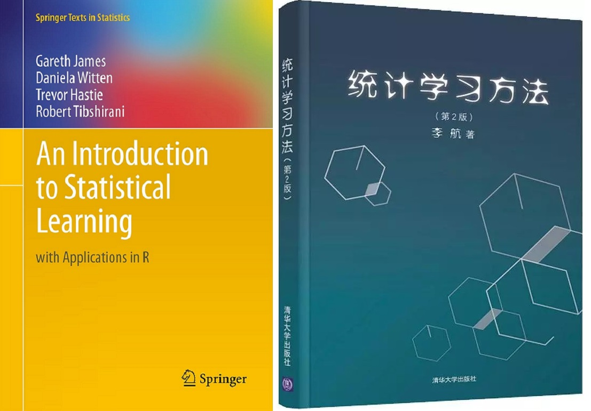

--------------------------------------------------------------------------------

## Book-title
- 《 统计学习方法 》 李航
- [An-Introduction-to-Statistical-Learning](http://faculty.marshall.usc.edu/gareth-james/ISL/)

## Software
- Language：Python3
- Compile：IPython
- IDE：JupyterLab \ JupyterNotebook

## Notebook
- 每一个 Notebook 里面的笔记都是摘抄于书籍，可能存在失误之处，请指正
- 代码借鉴参考 GitHub、Gitee 以及一些 Blog 等资源，感谢大佬们的奉献
- Notebook 里面的公式都是 符合 LaTeX 公式标准，并使用 LaTeX 规则写的
- Notebook 里面的思维导图，使用思维导图软件制作
- Notebook 里面的算法伪代码，都是使用 LaTeX 的 algorithm2e 这个包制作的

---------------------------------

## About Author

### 掌中星辰转日月，手心苍穹天外天。
&emsp;&emsp;&emsp;&emsp;&emsp;&emsp;&emsp;&emsp;&emsp;&emsp;&emsp;&emsp;&emsp;&emsp;&emsp;&emsp;&emsp;&emsp;——云主宰苍穹

### Stay Hungry, Stay Foolish.
&emsp;&emsp;&emsp;&emsp;&emsp;&emsp;&emsp;&emsp;&emsp;&emsp;&emsp;&emsp;&emsp;&emsp;&emsp;&emsp;&emsp;&emsp;——Steve Jobs

--------------------------------------------

- QQ Mail：2694048168@qq.com
- QQ：2694048168
- Weibo：云主宰苍穹
- GitHub: https://github.com/2694048168/
- Gitee：https://gitee.com/weili_yzzcq/
- Blog：https://2694048168.github.io/
- Blog：https://weili_yzzcq.gitee.io/ 
- Blog：https://blog.csdn.net/weixin_46782218/

-----------------------------------------------